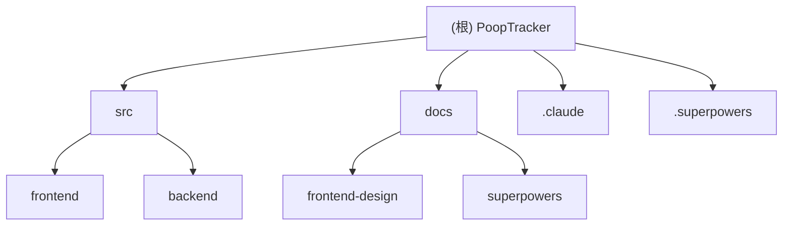

# CLAUDE.md

## 变更记录 (Changelog)

| 日期 | 变更 | 版本 |
|------|------|------|
| 2026-06-27 | 架构全量扫描更新：新增前端测试体系（Vitest + Testing Library + MSW，29 测试文件） | v2 |
| 2026-06-25 | LLM Provider 配置化 + 排便过程感受 + 统计增强 | v1.1 |
| 2026-06-24 | 初始项目架构：Next.js + FastAPI + SQLite + OpenAI | v1 |

---

## 模块索引

| 模块 | 路径 | 语言 | 说明 |
|------|------|------|------|
| 后端 API | `src/backend/` | Python | FastAPI REST 服务、数据库、AI 分析、用户认证 |
| 前端 UI | `src/frontend/` | TypeScript/React | Next.js App Router、组件、测试 |
| 文档 | `docs/` | Markdown | 设计系统、规格、计划、架构扫描 |
| CC 配置 | `.claude/` | JSON/MD | Claude Code 权限与技能 |
| SDD 记录 | `.superpowers/` | Markdown | Superpowers 任务记录（34 份） |

### 模块结构图

---

@AGENTS.md

## Claude Code 专属

### Superpowers 工作流
- 执行实施计划时，询问用户选择执行方式（默认 Inline Execution）：
  1. Subagent-Driven
  2. Inline Execution
- 前端开发使用 frontend-design skill 监控 UI 质量
