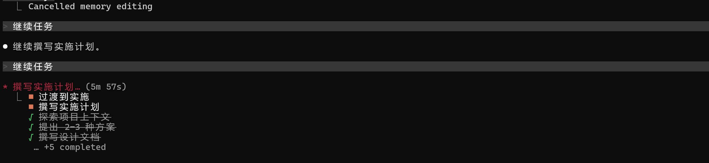

# JOURNAL.md - PoopTracker 开发日志

## Day 1 - 2026/06/24

### 今日目标
- 搭建项目结构
- 完成技术选型和架构设计
- 初始化 git 仓库

### 完成事项
- [x] 确定技术栈：Next.js + FastAPI + SQLite + uv + OpenAI API
- [x] 完成架构设计（记录、分析、统计三大模块）
- [x] 设计数据模型（records + analyses 表）
- [x] 搭建项目目录结构
- [x] 配置 AGENTS.md 约束条件
- [x] 使用 brainstorming skill 完成需求分析
- [x] 整理配置文件职责：AGENTS.md（通用）vs CLAUDE.md（CC 专属）

### CC 使用体验

**总结：**
- brainstorming skill 的流程：先探索上下文 → 逐个提问 → 提出方案 → 展示设计
- AGENTS.md 的作用：约束 AI 助手的行为，确保代码质量
- 自定义 skill 可以覆盖默认行为
- AGENTS.md 放通用项目信息（技术栈、目录结构），CLAUDE.md 只放 CC 专属配置

**遇到的问题：**
- brainstorming 的流程比较长，对于已经想好要做什么的情况，可以考虑是否需要简化
- 最初把技术栈和目录结构放在了 CLAUDE.md，后来意识到这些是通用信息应该放 AGENTS.md
- 使用superpowers接入国产模型，写plan的时候时间非常长，可能是上下文太长导致模型输出时效果不好，/compact压缩+切换模型

---

## Day 2 - 2026/06/25

### 完成事项

**前端 UI 全面重构（19 个文件）**
- [x] 建立暖色调设计令牌体系（鼠尾草绿主色、暖橙强调、奶油米色背景），保存到 `docs/frontend-design/design-system.md`
- [x] `globals.css` — 色彩/字体/圆角/阴影/动画全量重写，深色模式适配，SVG 噪点纹理
- [x] `RecordForm.tsx` — **可视化卡片选择器**替代下拉列表：形状（emoji 卡片）、颜色（圆形色盘）、气味/身体感受（卡片）
- [x] 新增 `DesktopNav.tsx` + `BottomNav.tsx` — 桌面端活跃态导航 + 移动端底部 Tab Bar
- [x] `button.tsx` / `card.tsx` — 胶囊形、微交互、暖调阴影
- [x] `Timer.tsx` — 脉冲光环动画、SSR hydration 安全
- [x] `RecordCard.tsx` / 详情页 — Dialog 替换 `window.confirm()`，图标装饰，emoji 映射
- [x] `StatsCharts.tsx` / `CalendarHeatmap.tsx` — 图表色板对齐设计令牌、平滑色阶
- [x] 各页面 — 统一空状态插画 + 加载 spinner + 入场动画
- [x] Code Review 修复 + 构建验证通过

**文档同步**
- [x] `AGENTS.md` / `README.md` 项目结构更新为详细版本

### 经验总结
- shadcn/ui CSS 变量改 20 个即可完成整套主题切换，设计令牌体系值得投入
- 可视化卡片选择器（emoji + 描述）比 Select 下拉更适合移动端和情感化设计
- `next/font/google` 构建时请求网络不通会失败，改用 `<link>` 加载更稳定
- `useSearchParams()` 在 Next.js 16 必须包裹 `<Suspense>` 否则 production build 报错
- Recharts `Cell` 的 `fill` 支持 `var(--chart-N)`，配合 CSS 变量可自动适配暗色模式

### CC 使用体验

**自定义 skill：`sync-project-docs`**
- 位置：`.claude/skills/sync-project-docs/`
- 作用：当项目结构/技术栈/架构/功能模块发生变动时，自动检查并同步更新 `AGENTS.md` 和 `README.md`
- 触发时机：Superpowers 工作流完成后、开发分支完结后、或手动调用 `/sync-project-docs`
- 原理：对比 git diff 识别四类变更（目录结构、技术栈、架构、功能模块），按 Surgical Changes 原则仅更新受影响的文档区域
- 本次使用场景：19 个文件重构后触发，更新了两份文档的项目结构树，使其从概览级变为 spec 级详细程度
- 体验：对于频繁迭代的项目，这种"检查—对比—精准更新"的模式比每次手动更新文档高效得多

**`frontend-design` skill**
- 本次用它完成了完整的 UI 重构流程：分析现有问题 → 制定设计方向 → 输出设计令牌 → 逐一实施组件改造
- 优点：强制在前端开发前先思考设计方向（不直接写代码），避免了"边写边设计"导致风格不统一
- 实际效果：19 个文件改造后风格紧密一致（颜色/圆角/阴影/动画全部来自同一套令牌），没有出现各组件风格割裂的情况