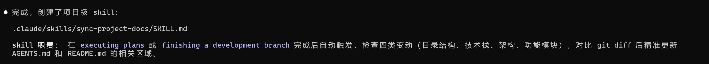

# JOURNAL.md - PoopTracker 开发日志

## Day 1 - 2026/06/24

### 今日目标
- 搭建项目结构
- 完成技术选型和架构设计
- 初始化 git 仓库

### 完成事项
- [x] 确定技术栈：Next.js + FastAPI + SQLite + uv + OpenAI API
- [x] 完成架构设计（记录、分析、统计三大模块）
- [x] 设计数据模型（records + analyses 表）
- [x] 搭建项目目录结构
- [x] 配置 AGENTS.md 约束条件
- [x] 使用 brainstorming skill 完成需求分析
- [x] 整理配置文件职责：AGENTS.md（通用）vs CLAUDE.md（CC 专属）

### CC 使用体验

**总结：**
- brainstorming skill 的流程：先探索上下文 → 逐个提问 → 提出方案 → 展示设计
- AGENTS.md 的作用：约束 AI 助手的行为，确保代码质量
- 自定义 skill 可以覆盖默认行为
- AGENTS.md 放通用项目信息（技术栈、目录结构），CLAUDE.md 只放 CC 专属配置
- AGENTs.md和claude.md中增加了superpowers的约束条件，在简单任务的时候不用使用subagent，默认使用
Inline Execution


**遇到的问题：**
- brainstorming 的流程比较长，对于已经想好要做什么的情况，可以考虑是否需要简化
- 最初把技术栈和目录结构放在了 CLAUDE.md，后来意识到这些是通用信息应该放 AGENTS.md
- 使用superpowers接入国产模型，写plan的时候时间非常长，可能是上下文太长导致模型输出时效果不好，/compact压缩+切换模型


---

## Day 2上午 - 2026/06/25

### 完成事项

**前端 UI 全面重构（19 个文件）**
- [x] 建立暖色调设计令牌体系（鼠尾草绿主色、暖橙强调、奶油米色背景），保存到 `docs/frontend-design/design-system.md`
- [x] `globals.css` — 色彩/字体/圆角/阴影/动画全量重写，深色模式适配，SVG 噪点纹理
- [x] `RecordForm.tsx` — **可视化卡片选择器**替代下拉列表：形状（emoji 卡片）、颜色（圆形色盘）、气味/身体感受（卡片）
- [x] 新增 `DesktopNav.tsx` + `BottomNav.tsx` — 桌面端活跃态导航 + 移动端底部 Tab Bar
- [x] `button.tsx` / `card.tsx` — 胶囊形、微交互、暖调阴影
- [x] `Timer.tsx` — 脉冲光环动画、SSR hydration 安全
- [x] `RecordCard.tsx` / 详情页 — Dialog 替换 `window.confirm()`，图标装饰，emoji 映射
- [x] `StatsCharts.tsx` / `CalendarHeatmap.tsx` — 图表色板对齐设计令牌、平滑色阶
- [x] 各页面 — 统一空状态插画 + 加载 spinner + 入场动画
- [x] Code Review 修复 + 构建验证通过

**文档同步**
- [x] `AGENTS.md` / `README.md` 项目结构更新为详细版本

### 经验总结
- shadcn/ui CSS 变量改 20 个即可完成整套主题切换，设计令牌体系值得投入
- 可视化卡片选择器（emoji + 描述）比 Select 下拉更适合移动端和情感化设计
- `next/font/google` 构建时请求网络不通会失败，改用 `<link>` 加载更稳定
- `useSearchParams()` 在 Next.js 16 必须包裹 `<Suspense>` 否则 production build 报错
- Recharts `Cell` 的 `fill` 支持 `var(--chart-N)`，配合 CSS 变量可自动适配暗色模式

### CC 使用体验

**自定义 skill：`sync-project-docs`**
- 位置：`.claude/skills/sync-project-docs/`

- 作用：当项目结构/技术栈/架构/功能模块发生变动时，自动检查并同步更新 `AGENTS.md` 和 `README.md`
- 触发时机：Superpowers 工作流完成后、开发分支完结后、或手动调用 `/sync-project-docs`
- 原理：对比 git diff 识别四类变更（目录结构、技术栈、架构、功能模块），按 Surgical Changes 原则仅更新受影响的文档区域
- 本次使用场景：19 个文件重构后触发，更新了两份文档的项目结构树，使其从概览级变为 spec 级详细程度
- 体验：对于频繁迭代的项目，这种"检查—对比—精准更新"的模式比每次手动更新文档高效得多

**`frontend-design` skill**
- 本次用它完成了完整的 UI 重构流程：分析现有问题 → 制定设计方向 → 输出设计令牌 → 逐一实施组件改造
- 优点：强制在前端开发前先思考设计方向（不直接写代码），避免了"边写边设计"导致风格不统一
- 实际效果：19 个文件改造后风格紧密一致（颜色/圆角/阴影/动画全部来自同一套令牌），没有出现各组件风格割裂的情况

---

## Day 2 下午 - 2026/06/25

### 三大功能开发（brainstorming → writing-plans → subagent-driven）

**需求：** 1) LLM Provider 配置化+SSE 流式 2) 排便过程感受全栈新增 3) 统计卡片+柱状图增强

### 完成事项
- [x] Brainstorming：逐需求确认（SSE vs WebSocket、过程感受 7 枚举值、9 卡片 3 列网格、柱状图渐变+动画），产出 spec
- [x] Writing-plans：9 Task，每 Task 含完整代码+测试，后端 Task 嵌入测试更新
- [x] Subagent-Driven：9 Task 全完成（实现→审查→修复→重审），11 commits，22/22 测试通过
- [x] 全分支审查：发现 2 Critical（DB 迁移+provider 硬编码），已修复
- [x] 文档同步：README/AGENTS/JOURNAL

### 关键改动
| 层 | 内容 |
|---|------|
| 后端 | `OpenAICompatibleProvider`（.env 6 参数）、SSE 端点、`process_feeling` 列+枚举、`get_stats()` 9 个 summary 指标 |
| 前端 | `StreamingAnalysisCard`（打字机）、`StatsSummaryCards`（9 卡片）、RecordForm 过程感受选择器、柱状图渐变+毛玻璃 |
| 测试 | 22 用例覆盖全部改动 |

### 经验总结
- **Superpowers 全流程：** brainstorming 确认需求 → writing-plans 拆解→ subagent-driven 逐 Task 执行+审查，变更高度受控
- **双层门禁有效：** 逐 Task reviewer 发现 3 个 Important（流式去重、硬编码、null 防护），全分支审查发现 2 个跨 Task Critical
- **SQLite 迁移坑：** `create_all()` 不新增列，需 `PRAGMA table_info` + `ALTER TABLE`

### CC 使用体验

**`subagent-driven-development` skill**
- 流程：读计划→task brief→分发实现→审查→修复→重审→下一 Task
- 子代理只拿自己 brief+接口上下文，不被其他 Task 干扰，执行质量高
- 审查循环有效：Task 1 的 3 个 Important 问题在修复后重审通过才继续
- 整体 9 Task 约 15min，适合有明确 spec/plan 的多步骤独立开发
- 使用subagent更加消耗token,因为子agent是干净的上下文无妨更好的使用模型的缓存
如果是在不复杂的任务下可以使用Inline Execution模式

---

## Day 3 - 2026/06/26

### 今日目标
- 用户认证与数据隔离功能全栈实现
- 修复上线后发现的几个 Bug

### 用户认证系统（全栈）

**需求：** JWT 登录、后端注册接口（不暴露前端页面）、两个测试账号、数据按 user_id 隔离、预留微信 openid

**实施方案：** brainstorming → writing-plans（15 Task）→ subagent-driven 执行

**完成事项：**
- [x] 后端：`User` 模型（username/password_hash/wechat_openid）、`dependencies/auth.py`（JWT 签发+验证）、`routers/auth.py`（login/register/me）
- [x] 后端：Record/Analysis 模型新增 `user_id` 外键（索引），所有路由注入 `get_current_user` 依赖
- [x] 后端：service 层全量增加 `user_id` 参数，查询均按 user_id 过滤
- [x] 后端：lifespan 中兼容迁移（PRAGMA + ALTER TABLE）、种子用户（user1/user2:123456）、旧数据归入 user1
- [x] 前端：`useAuth` hook（AuthProvider Context + localStorage Token 管理）、login 页面
- [x] 前端：`AuthGuard` 路由守卫（未登录→/login、已登录→/、加载态）
- [x] 前端：`api.ts` request() 自动注入 `Authorization: Bearer <token>`
- [x] 前端：DesktopNav 显示用户名+退出按钮
- [x] 测试：24/24 通过，含未授权 401、用户数据隔离用例
- [x] bcrypt 版本踩坑：passlib 1.7.4 不兼容 bcrypt 5.x，锁定 `bcrypt>=4.0.0,<4.1.0`

### Bug 修复

1. **AuthGuard Hydration 错误** — `<div>` 直接作为 `<html>` 子元素。修复：加载态包裹 `<body>` 标签
2. **时区偏移 8 小时** — `datetime-local` 输入框期望本地时间，但 `RecordForm` 用 `slice(0,16)` 直接截取 UTC 字符串。修复：新增 `utcToLocalDatetime()` 工具函数，利用 `new Date()` 本地时区转换
3. **记录列表 401 Unauthorized** — `RecordList.tsx` 和 `page.tsx` 是 Server Component，在服务端执行 `recordsApi.list()`，此时 `window` 为 undefined，Token 不会被注入请求头。修复：改为 Client Component，数据获取移至 `useEffect` 中浏览器端执行

### CC 使用体验

**systematic-debugging skill**
- 时区问题：逐层追踪数据流（Timer→URL param→RecordForm→datetime-local input），发现 UTC/本地时间转换断层
- 401 问题：追踪 Token 传递链路（localStorage→api.ts→HTTP header→后端），发现 Server Component 执行环境无 `window` 对象
- 体会：「每次都先完整调查再动手」避免了很多无效尝试

**Server Component vs Client Component 的教训**
- Next.js App Router 中，Server Component 调用 `localStorage` 的代码会静默跳过
- `typeof window !== "undefined"` 的守卫让错误不明显——Server Component 不发 Token、后端返回 401、catch 块静默吞错
- 规则：任何依赖浏览器 API（localStorage/fetch with auth）的数据请求，必须在 Client Component 的 `useEffect` 中执行

### 后续工作 TODO
- [ ] 后端数据库从 SQLite 升级为 PostgreSQL
- [ ] 设计并实现更完善的权限体系
- [ ] 为每个账号增加每周可用 AI 分析次数限制，而不是无限可用
- [ ] 升级为微信小程序版本

---

## Day 4 - 2026/06/27

### 今日目标
- 建立前端测试体系，从零覆盖到所有现有功能模块

### AGENTS.md 测试约束

**先补约束再写代码：**
- [x] 前端测试：Vitest + @testing-library/react + @testing-library/jest-dom，每个新增组件/页面/Hook/工具函数必须有对应测试，API 调用使用 MSW mock
- [x] 后端测试：pytest + httpx，每个新增路由/Service/工具函数必须有对应测试
- [x] 测试纪律：TDD 红→绿→重构，提交前运行完整测试套件，CI 中测试失败视为阻塞

### 前端测试基础设施（全量覆盖）

**流程：** brainstorming → writing-plans（32 Task，4 Phase）→ subagent-driven 执行

**实施方案决策：**
- 范围：全量覆盖（不限于新功能）
- 工具链：Vitest + RTL + MSW（jsdom）
- 目录：统一 `src/frontend/tests/` 按模块分子目录
- 执行方式：Subagent-Driven（Phase 1-3 用子代理，Phase 4 页面测试直接内联编写）

**技术踩坑：**
- `@vitejs/plugin-react` 与 shadcn 的 babel 版本冲突（7.x vs 8.x），移除插件，Vitest 通过 esbuild 处理 JSX
- MSW postinstall 在 bash PATH 中找不到 node，用 `--ignore-scripts` 跳过（仅浏览器 Service Worker 需要）
- MSW 路由匹配顺序：`/api/records/calendar` 和 `/api/records/stats` 必须注册在 `/api/records/:id` 之前，否则被 `:id` 通配捕获返回 404
- `vi.mock` 被 Vitest hoist 到模块顶层，闭包变量不可用。修复方案：测试文件顶层 `vi.mock` + `vi.hoisted()` 创建可变状态对象传递
- Server Component 页面测试中，子 Client Component 使用的 `useRouter`/`usePathname`/`useParams` 都需要在 `vi.mock("next/navigation")` 中 mock

### 完成事项

**Phase 1: 基础设施搭建（6 文件）**
- [x] `vitest.config.ts` — jsdom 环境 + @/ 别名 + setup 文件
- [x] `tests/setup.ts` — MSW server 生命周期管理
- [x] `tests/mocks/handlers.ts` — auth/records CRUD/calendar/stats/analyses 全套 MSW handler，闭包内存数据
- [x] `tests/mocks/server.ts` — setupServer 实例
- [x] `tests/helpers/render-utils.tsx` — `renderWithAuth`（AuthProvider 包裹 + token 预设）、`createMockRouter`、`mockNextNavigation`（navState 驱动）
- [x] `package.json` — 7 个 devDependencies + test/test:watch 脚本

**Phase 2: Lib + Hooks 测试（5 文件，37 测试）**
- [x] `tests/lib/utils.test.ts` — cn() class 合并（5 测试）
- [x] `tests/lib/datetime.test.ts` — 6 个日期工具函数（11 测试）
- [x] `tests/lib/records-events.test.ts` — 事件总线（3 测试）
- [x] `tests/lib/api.test.ts` — recordsApi 9 个 + analysesApi 3 个（12 测试）
- [x] `tests/hooks/useAuth.test.tsx` — login/logout/isLoading/isAuthenticated（6 测试）

**Phase 3: 业务组件测试（12 文件，49 测试）**
- [x] AuthGuard、BottomNav、DesktopNav — 导航鉴权组件
- [x] Timer — 计时器（fake timers）
- [x] RecordCard、RecordForm、RecordList — 记录 CRUD 组件
- [x] CalendarHeatmap — 日历热力图
- [x] StatsSummaryCards、StatsCharts — 统计图表组件
- [x] AnalysisCard、StreamingAnalysisCard — AI 分析卡片组件

**Phase 4: 页面测试（9 文件，22 测试）**
- [x] LoginPage — 表单渲染、空提交校验、登录跳转
- [x] HomePage — 标题、Timer 按钮、空状态
- [x] RecordsPage — 标题、新增按钮
- [x] NewRecordPage — 标题、保存/取消按钮（Suspense 包裹 RecordForm）
- [x] RecordDetailPage — 详情加载、编辑/删除按钮（useParams mock）
- [x] EditRecordPage — 更新记录按钮、取消按钮（useParams mock）
- [x] AnalysisPage — 标题、快捷按钮（今天/近7天/近14天/近30天）、开始分析、历史区域
- [x] CalendarPage — 标题、月份热力图
- [x] StatsPage — 标题、范围选择器

### 最终统计

```
26 个测试文件 | 108 个测试用例 | 100% 通过率

Phase 1 (基础设施):  6 文件
Phase 2 (Lib+Hooks):  5 文件, 37 测试
Phase 3 (组件测试):  12 文件, 49 测试
Phase 4 (页面测试):   9 文件, 22 测试
```

### CC 使用体验

**`finishing-a-development-branch` 技能的问题**
- 该技能把 `npx tsc --noEmit`（TypeScript 类型检查）当成了前端测试的等价物，认为类型检查通过即质量合格
- 导致此前前端没有任何实际测试用例，类型检查无法替代运行时行为验证
- **教训：** 在 brainstorming 澄清环节需要对此类情况进行约束——前后端都必须有测试用例才能保证代码质量，不能以类型检查或构建成功替代

**AGENTS.md 中增加前端测试约束**
- 明确约束：前端测试使用 Vitest + @testing-library/react + MSW，后端测试使用 pytest + httpx
- 明确测试纪律：新功能或 bug 修复必须先写测试（红→绿→重构），不得以"简单"、"赶时间"为由跳过
- 将测试要求从口头约定变为文档化约束，后续任何开发分支都必须遵守

