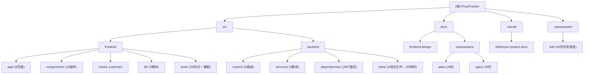

# PoopTracker 架构扫描报告

> 扫描日期：2026-06-27 | 扫描工具：init-architect (自适应版)
> 仓库：solo-bblog | 分支：dev

---

## 一、项目概述

**PoopTracker（便便健康记录工具）** 是一个 Web 应用，帮助用户记录每日如厕情况，通过 AI 分析给出肠道健康建议。

**核心价值主张：**
- 便捷记录如厕数据（计时器 + 手动）
- 可视化展示历史数据和趋势
- AI 分析一段时间内的记录，给出专业健康建议

**技术栈：**
- 前端：Next.js 16 + TypeScript 5 + Tailwind CSS 4 + shadcn/ui
- 后端：Python FastAPI + SQLite + SQLAlchemy 2.0 + uv（包管理）
- AI：OpenAI 兼容协议（自定义 Provider 抽象层，支持 DeepSeek / Qwen / GLM 切换）
- 认证：JWT Token（python-jose + passlib[bcrypt]），7 天有效期
- 测试：后端 pytest + httpx；前端 Vitest + Testing Library + MSW

---

## 二、目录拓扑与模块划分

### 2.1 根目录结构

```
solo-bblog/
├── README.md                 # 项目说明
├── JOURNAL.md                # 开发日志
├── AGENTS.md                 # 项目概述 + AI 行为约束 + 测试规范
├── CLAUDE.md                 # Claude Code 专属配置
├── .claude/                  # Claude Code settings/skills
├── .gitignore                # 忽略 session/*、.claude/*
├── .superpowers/             # Superpowers SDD 任务记录 (34 份报告)
├── src/
│   ├── frontend/             # [模块A] Next.js 前端 (+ 测试套件)
│   └── backend/              # [模块B] FastAPI 后端
├── docs/
│   ├── architecture-scan.md  # 本文件
│   ├── frontend-design/      # 前端设计系统文档
│   └── superpowers/
│       ├── plans/            # 实施计划（4份）
│       └── specs/            # 设计规格文档（4份）
├── images/                   # 静态参考图
└── session/                  # (已忽略) 临时会话文件
```

### 2.2 文件统计

| 分类 | 数量 | 说明 |
|------|------|------|
| Python 源文件 (.py) | ~20 | 后端全部代码（含 `__init__.py`、conftest.py） |
| TypeScript/TSX 源文件 (.ts/.tsx) | ~36 | 前端全部业务代码 |
| 前端测试文件 (.test.ts/.test.tsx) | 29 | Vitest + Testing Library（2026-06-27 新增） |
| 配置文件 | ~12 | pyproject.toml, package.json, tsconfig, vitest.config.ts 等 |
| 文档文件 (.md) | ~15 | README, AGENTS, CLAUDE, specs, plans, design-system, architecture-scan |
| 后端测试文件 (.py) | 5 | pytest 测试（conftest + 4 个测试文件 + `__init__.py`） |
| 前端测试辅助文件 | 3 | setup.ts, mocks/server.ts, mocks/handlers.ts, helpers/render-utils.tsx |
| 锁定文件 | 2 | uv.lock, package-lock.json |
| SDD 任务报告 | 34 | .superpowers/sdd/ 下的 brief/report 文件 |

**语言占比：** TypeScript/TSX ~42%, Python ~24%, Markdown ~18%, JSON/TOML ~11%, CSS ~3%, 其他 ~2%

### 2.3 忽略统计

| 忽略路径 | 原因 |
|----------|------|
| `.git/` | Git 内部文件 |
| `.claude/*` | 根 .gitignore 显式忽略 |
| `session/*` | 根 .gitignore 显式忽略 |
| `__pycache__/` | Python 字节码缓存 |
| `*.pyc` | Python 字节码 |
| `data/` | SQLite 数据库文件 |
| `.env` / `.env*` | 环境变量文件 |
| `.next/` | Next.js 构建输出 |
| `node_modules/` | npm 依赖 |
| `.venv/` | Python 虚拟环境 |
| `*.lock` | 依赖锁定文件 |
| `*.png, *.jpg, *.svg, *.ico, *.gif` | 静态资源/图片（仅记录路径） |

---

## 三、模块结构图



---

## 四、模块索引

| 模块路径 | 语言 | 职责 | 入口文件 | 测试 | 配置 |
|----------|------|------|----------|------|------|
| `src/backend/` | Python 3.10+ | REST API 服务、数据库、AI 分析、用户认证 | `main.py` | `tests/` (4 文件, ~33 用例) | `pyproject.toml`, `.env` |
| `src/frontend/` | TypeScript/React | Web UI、路由、状态管理、SSE 流式消费 | `src/app/layout.tsx` | `tests/` (29 文件) | `package.json`, `tsconfig.json`, `vitest.config.ts` |
| `docs/` | Markdown | 设计文档、实施计划、设计系统、架构扫描 | N/A | N/A | N/A |
| `.claude/` | JSON/Markdown | Claude Code 权限与技能配置 | N/A | N/A | `settings.json` |
| `.superpowers/` | Markdown | Superpowers SDD 任务记录 | N/A | N/A | N/A |

---

## 五、模块详尽扫描

### 5.1 模块A：`src/backend/` -- FastAPI 后端

#### 5.1.1 入口与启动

- **入口文件：** `main.py`
- **应用工厂：** `FastAPI(title="PoopTracker API", version="0.1.0", lifespan=lifespan)`
- **启动命令：** `uv run uvicorn main:app --reload`
- **生命周期（lifespan）：**
  1. 建表 `Base.metadata.create_all(bind=engine)`
  2. 创建 `app_meta` 兼容表（用于迁移标记）
  3. 执行数据库迁移（PRAGMA table_info + ALTER TABLE）：`process_feeling`、`user_id` 字段
  4. 移除旧唯一索引 `uq_analyses_user_daterange`
  5. UTC 到本地时间迁移（`migrate_legacy_utc_datetimes`）
  6. 创建测试账号 user1 / user2（密码 123456）
  7. 旧数据关联到 user1

- **CORS 中间件：** 允许 `http://localhost:3000`，全部方法和头部
- **健康检查：** `GET /api/health` 返回 `{"status": "ok"}`

#### 5.1.2 对外接口（API 路由）

**认证路由 (`routers/auth.py`)** -- 前缀 `/api/auth`

| 端点 | 方法 | 鉴权 | 请求体 | 响应 | 说明 |
|------|------|------|--------|------|------|
| `/api/auth/register` | POST | 无 | `RegisterRequest` | `TokenResponse` (201) | 注册（仅后端，前端不暴露） |
| `/api/auth/login` | POST | 无 | `LoginRequest` | `TokenResponse` | 登录，返回 JWT |
| `/api/auth/me` | GET | Bearer Token | 无 | `UserResponse` | 当前用户信息 |

**记录路由 (`routers/records.py`)** -- 前缀 `/api/records`

| 端点 | 方法 | 鉴权 | 请求体/参数 | 响应 | 说明 |
|------|------|------|-------------|------|------|
| `/api/records` | POST | Bearer Token | `RecordCreate` | `RecordResponse` (201) | 创建记录 |
| `/api/records` | GET | Bearer Token | `?date_from=&date_to=` | `list[RecordResponse]` | 列表查询（按日期筛选） |
| `/api/records/calendar` | GET | Bearer Token | `?month=YYYY-MM` | `list[dict]` | 日历热力图数据 |
| `/api/records/stats` | GET | Bearer Token | `?days=7` | `StatsResponse` | 统计数据（频率/时长/分布/summary） |
| `/api/records/{id}` | GET | Bearer Token | -- | `RecordResponse` | 单条详情 |
| `/api/records/{id}` | PUT | Bearer Token | `RecordUpdate` | `RecordResponse` | 更新记录 |
| `/api/records/{id}` | DELETE | Bearer Token | -- | 204 No Content | 删除记录 |

**分析路由 (`routers/analyses.py`)** -- 前缀 `/api/analyses`

| 端点 | 方法 | 鉴权 | 请求体/参数 | 响应 | 说明 |
|------|------|------|-------------|------|------|
| `/api/analyses` | POST | Bearer Token | `AnalysisRequest` | `AnalysisResponse` (201) | 触发 AI 分析（非流式） |
| `/api/analyses` | GET | Bearer Token | -- | `list[AnalysisResponse]` | 分析历史列表 |
| `/api/analyses/{id}` | GET | Bearer Token | -- | `AnalysisResponse` | 分析详情 |
| `/api/analyses/stream` | POST | Bearer Token | `AnalysisRequest` | `StreamingResponse` (SSE) | 流式 AI 分析 |

**SSE 事件类型：**
- `summary_chunk`: 分析摘要的增量文本片段
- `suggestions`: 健康建议列表（末尾一次性推送）
- `done`: 流式结束标记
- `error`: 错误信息

#### 5.1.3 数据模型 (`models.py`)

| 表名 | 字段 | 类型 | 说明 |
|------|------|------|------|
| `users` | id | Integer PK | 自增 |
| | username | String(50) UNIQUE | 用户名 |
| | password_hash | String(128) | bcrypt 哈希 |
| | wechat_openid | String(100) UNIQUE (nullable) | 预留小程序绑定 |
| | created_at | DateTime | 注册时间 (UTC) |
| `records` | id | Integer PK | 自增 |
| | user_id | FK->users.id, INDEX | 数据归属 |
| | start_time | DateTime | 开始时间 |
| | end_time | DateTime (nullable) | 结束时间 |
| | duration | Integer (nullable) | 如厕秒数 |
| | shape | String(20) (nullable) | 布里斯托分类 1-7 |
| | color | String(20) (nullable) | 颜色枚举 |
| | smell | String(20) (nullable) | 气味枚举 |
| | comfort | String(20) (nullable) | 身体感受枚举 |
| | process_feeling | String(20) (nullable) | 排便过程感受 |
| | notes | Text (nullable) | 备注 |
| | input_mode | String(10) | timer / manual |
| | created_at | DateTime | 创建时间 (UTC) |
| | updated_at | DateTime | 更新时间 (UTC, onupdate) |
| `analyses` | id | Integer PK | 自增 |
| | user_id | FK->users.id, INDEX | 数据归属 |
| | date_from | DateTime | 分析起始日期 |
| | date_to | DateTime | 分析结束日期 |
| | provider | String(50) | LLM 厂商标识 |
| | model | String(50) | 模型名称 |
| | summary | Text | AI 分析摘要 |
| | suggestions | Text (nullable) | JSON 格式的建议列表 |
| | record_ids | Text (nullable) | JSON 格式的关联记录 ID |
| | created_at | DateTime | 创建时间 (UTC) |

#### 5.1.4 Schema 枚举定义 (`schemas.py`)

| 枚举类型 | 可选值 |
|----------|--------|
| `ShapeEnum` | 1-7（布里斯托大便分类法） |
| `ColorEnum` | brown, dark_brown, yellow, green, black, red, other |
| `SmellEnum` | normal, strong, odorless, other |
| `ComfortEnum` | comfortable, bloating, pain, difficulty, other |
| `ProcessFeelingEnum` | smooth, urgent, straining, incomplete, intermittent, normal, other |
| `InputModeEnum` | timer, manual |

#### 5.1.5 业务逻辑层 (`services/`)

| 文件 | 职责 | 关键函数 |
|------|------|----------|
| `record_service.py` | 记录 CRUD + 统计 + 日历 | `create_record`, `get_records`, `get_record_by_id`, `update_record`, `delete_record`, `get_calendar_data`, `get_stats` |
| `analysis_service.py` | AI 分析触发与存储 | `run_analysis`, `get_analyses`, `get_analysis_by_id` |
| `llm_provider.py` | LLM Provider 抽象层 | `LLMProvider`(ABC), `OpenAICompatibleProvider`(实现), `get_provider`(工厂) |

**LLM Provider 设计模式：**
- 抽象基类 `LLMProvider` 定义 `analyze()`（同步）和 `analyze_stream()`（流式生成器）两个方法
- `OpenAICompatibleProvider` 通过 `os.getenv()` 读取全部配置（model, api_key, base_url, temperature, max_tokens, provider_name）
- 流式分析使用 SSE 协议，通过 `---SUGGESTIONS---` 分隔符区分摘要和 JSON 建议
- 工厂函数 `get_provider()` 直接返回 `OpenAICompatibleProvider` 实例

**统计数据计算（`get_stats`）：**
- 计算项：总记录数、本周记录数、平均时长、最长时长、最常见形状、异常天数、日平均频率、连续打卡天数
- 图表数据：每日频率、每日平均时长趋势、形状分布

#### 5.1.6 鉴权机制

- **算法：** HS256 JWT，有效期 7 天（`TOKEN_EXPIRE_SECONDS = 7 * 24 * 60 * 60`）
- **密钥：** `JWT_SECRET` 环境变量，默认 `pooptracker-local-dev-secret`
- **依赖注入：** `get_current_user` 通过 `HTTPBearer` 提取 Authorization 头，解码 JWT 并查询 User 对象
- **数据隔离：** 所有 Record/Analysis 查询按 `user_id` 过滤，确保用户间数据隔离

#### 5.1.7 数据库配置 (`database.py`)

- **引擎：** SQLite，文件路径 `src/backend/data/pooptracker.db`
- **连接参数：** `check_same_thread=False`（FastAPI 异步兼容）
- **会话管理：** `SessionLocal` (sessionmaker)，`get_db()` FastAPI 依赖生成器
- **迁移策略：** 利用 `lifespan` 中的 `PRAGMA table_info` 检测并 `ALTER TABLE ADD COLUMN`

#### 5.1.8 测试策略

**测试框架：** pytest + httpx + TestClient

| 测试文件 | 用例数 | 覆盖范围 |
|----------|--------|----------|
| `conftest.py` | 3 fixtures | 测试数据库初始化、TestClient、auth_headers（自动创建 testuser 账号） |
| `test_records.py` | 14 | CRUD 全流程、process_feeling、未授权访问、用户隔离、UTC 迁移 |
| `test_analyses.py` | 9 | 分析触发、列表、详情、空记录、本地日期、SSE 流式、持久化 |
| `test_llm_provider.py` | 5 | Provider 接口、输出格式、流式协议、get_provider 工厂 |
| `test_calendar_stats.py` | 5 | 日历数据、本地日期、统计汇总字段 |
| **合计** | **~33** | 后端 API 全覆盖 |

**测试环境：** 使用独立 `data/test.db` 数据库，每个测试前后自动重建（`Base.metadata.create_all` / `drop_all`），通过 `dependency_overrides` 注入测试数据库会话，conftest 自动创建测试用户 `testuser:123456`。

#### 5.1.9 依赖清单

| 依赖 | 版本 | 用途 |
|------|------|------|
| fastapi | >=0.115.0 | Web 框架 |
| uvicorn[standard] | >=0.30.0 | ASGI 服务器 |
| sqlalchemy | >=2.0.0 | ORM |
| openai | >=1.50.0 | LLM SDK（OpenAI 兼容） |
| python-dotenv | >=1.0.0 | 环境变量加载 |
| pydantic | >=2.0.0 | 数据校验 |
| python-jose[cryptography] | >=3.3.0 | JWT 生成与验证 |
| passlib[bcrypt] | >=1.7.4 | 密码哈希 |
| bcrypt | >=4.0.0,<4.1.0 | bcrypt 后端 |
| pytest | >=8.0.0 | 测试框架 (dev) |
| httpx | >=0.27.0 | 测试 HTTP 客户端 (dev) |

---

### 5.2 模块B：`src/frontend/` -- Next.js 前端

#### 5.2.1 入口与路由结构

**框架：** Next.js 16.2.9（App Router） + React 19.2.4

**页面路由：**

| 路由 | 文件 | 说明 |
|------|------|------|
| `/login` | `src/app/login/page.tsx` | 登录页面（无鉴权） |
| `/` | `src/app/page.tsx` | 首页：计时器 + 今日记录总览 |
| `/records` | `src/app/records/page.tsx` | 记录列表页（含筛选器） |
| `/records/new` | `src/app/records/new/page.tsx` | 新增记录表单 |
| `/records/[id]` | `src/app/records/[id]/page.tsx` | 记录详情页 |
| `/records/[id]/edit` | `src/app/records/[id]/edit/page.tsx` | 编辑记录表单 |
| `/calendar` | `src/app/calendar/page.tsx` | 日历热力图视图 |
| `/stats` | `src/app/stats/page.tsx` | 统计图表页 |
| `/analysis` | `src/app/analysis/page.tsx` | AI 分析页 |

**根布局 (`layout.tsx`)：**
- 包裹 `<AuthGuard>`，实现路由级鉴权
- 引入 Google Fonts：Nunito（西文字体）
- metadata: "PoopTracker - 便便健康记录"

#### 5.2.2 导航系统

**双导航模式（响应式）：**

| 导航组件 | 显示条件 | 样式 | 路由项 |
|----------|----------|------|--------|
| `DesktopNav.tsx` | >=768px (`md:`) | 顶部固定栏，毛玻璃模糊背景 | 首页/日历/记录/统计/AI 分析 + 用户信息 + 退出 |
| `BottomNav.tsx` | <768px | 底部固定 Tab Bar，毛玻璃，适配安全区 | 首页/日历/记录/统计/AI 分析（图标 + 标签） |

**活跃状态：** 使用 `usePathname()` 判断当前路由，主要高亮为 `bg-primary/15 text-primary`。

#### 5.2.3 鉴权流程

**AuthGuard 组件：**
1. 包裹于 `layout.tsx` 根布局
2. 使用 `AuthProvider`（React Context）全局管理认证状态
3. 初始化时从 `localStorage` 读取 token，调用 `/api/auth/me` 验证
4. 未登录时重定向到 `/login`（登录页面除外）
5. 已登录时访问 `/login` 自动重定向到 `/`
6. 加载中显示"加载中..."占位

**useAuth Hook：**
- 提供：`login(username, password)`、`logout()`、`user`、`token`、`isAuthenticated`、`isLoading`
- Token 存储在 `localStorage`，key 为 `pooptracker_token`
- Login 调用 `/api/auth/login`，成功后存储 token 并设置用户状态

**API 客户端 Token 注入 (`lib/api.ts`)：**
- 每次请求自动从 `localStorage` 读取 token 并附加 `Authorization: Bearer <token>` 头
- SSE 流式请求同样自动注入 token

#### 5.2.4 核心组件清单

**UI 基础组件 (`components/ui/`)** -- 基于 shadcn/ui：

| 组件 | 文件 | 用途 |
|------|------|------|
| Button | `button.tsx` | 按钮（含 variant/size） |
| Card | `card.tsx` | 卡片容器 |
| Input | `input.tsx` | 文本/日期输入 |
| Label | `label.tsx` | 表单标签 |
| Select | `select.tsx` | 下拉选择 |
| Textarea | `textarea.tsx` | 多行文本 |
| Dialog | `dialog.tsx` | 模态对话框（删除确认等） |
| Sonner | `sonner.tsx` | Toast 通知 |

**业务组件：**

| 组件 | 文件 | 职责 |
|------|------|------|
| `Timer` | `timer/Timer.tsx` | 计时器：开始/停止，时间格式化 MM:SS，脉冲光环动画 |
| `RecordForm` | `records/RecordForm.tsx` | 记录表单：时间/形状/颜色/气味/感受/过程感受/备注（多区域分区式） |
| `RecordCard` | `records/RecordCard.tsx` | 记录卡片：时间、属性标签、emoji、编辑/删除操作 |
| `RecordList` | `records/RecordList.tsx` | 记录列表 + 筛选面板：日期范围、形状筛选、快捷时段、移动端折叠 |
| `CalendarHeatmap` | `calendar/CalendarHeatmap.tsx` | 日历热力图：月视图、点击日期查看当天记录 |
| `StatsSummaryCards` | `charts/StatsSummaryCards.tsx` | 统计摘要卡片：9 项指标 |
| `StatsCharts` | `charts/StatsCharts.tsx` | 统计图表：响应式容器 + BarChart/LineChart/PieChart (recharts) |
| `AnalysisCard` | `analysis/AnalysisCard.tsx` | 分析卡片：展开/收起、摘要预览、建议列表 |
| `StreamingAnalysisCard` | `analysis/StreamingAnalysisCard.tsx` | 流式分析卡片：实时打字机效果、自动滚动、光标闪烁 |
| `DesktopNav` | `nav/DesktopNav.tsx` | 桌面端顶部导航（含用户信息和退出按钮） |
| `BottomNav` | `nav/BottomNav.tsx` | 移动端底部 Tab Bar（5 个图标导航） |
| `AuthGuard` | `AuthGuard.tsx` | 路由鉴权守卫 + 布局包裹 |

#### 5.2.5 工具库 (`lib/`)

| 文件 | 职责 |
|------|------|
| `api.ts` | API 客户端：自动 Token 注入、recordsApi + analysesApi（含 SSE 流式） |
| `types.ts` | TypeScript 类型定义：RecordData/RecordCreate/RecordUpdate/AnalysisData/StatsData + 枚举常量和显示映射（含中文标签和 emoji） |
| `datetime.ts` | 时间工具：`getLocalTodayString`、`formatRecordDateTime`、`normalizeDateTimeLocalValue`、`getCurrentLocalDateTimeString` |
| `records-events.ts` | 自定义事件系统：`RECORDS_CHANGED_EVENT` + `emitRecordsChanged()`，实现跨组件状态同步 |
| `utils.ts` | `cn()` 函数（clsx + tailwind-merge） |

#### 5.2.6 状态管理与通信

**跨组件通信：** 使用浏览器 CustomEvent (`pooptracker:records-changed`)
- 触发场景：创建/更新/删除记录后
- 监听组件：首页、RecordList、CalendarHeatmap、StatsCharts

**认证状态：** React Context (`AuthProvider` / `useAuth`)

**API 调用模式：** 各组件直接调用 `recordsApi` / `analysesApi` 模块，通过 `useState` + `useEffect` 管理数据状态。

#### 5.2.7 测试策略（2026-06-27 新增）

**测试框架：** Vitest 4.1.9 + @testing-library/react 16 + MSW 2 + jsdom

**配置：** `vitest.config.ts` -- jsdom 环境、`tests/setup.ts` 全局 setup、`@/` 路径别名

**目录结构：**

```
src/frontend/tests/
├── setup.ts                        # jest-dom matchers + MSW 生命周期
├── helpers/
│   └── render-utils.tsx            # renderWithAuth / createMockRouter / mockNextNavigation
├── mocks/
│   ├── handlers.ts                 # MSW 请求处理器（auth + records CRUD + analyses）
│   └── server.ts                   # MSW server 实例
├── lib/                            # 4 文件
│   ├── api.test.ts
│   ├── datetime.test.ts
│   ├── utils.test.ts
│   └── records-events.test.ts
├── hooks/                          # 1 文件
│   └── useAuth.test.tsx
├── components/                     # 11 文件
│   ├── AuthGuard.test.tsx
│   ├── BottomNav.test.tsx
│   ├── DesktopNav.test.tsx
│   ├── RecordCard.test.tsx
│   ├── RecordForm.test.tsx
│   ├── RecordList.test.tsx
│   ├── CalendarHeatmap.test.tsx
│   ├── AnalysisCard.test.tsx
│   ├── StreamingAnalysisCard.test.tsx
│   ├── StatsSummaryCards.test.tsx
│   ├── StatsCharts.test.tsx
│   └── Timer.test.tsx
└── app/                            # 9 文件
    ├── page.test.tsx
    ├── login/page.test.tsx
    ├── records/page.test.tsx
    ├── records/new/page.test.tsx
    ├── records/[id]/page.test.tsx
    ├── records/[id]/edit/page.test.tsx
    ├── analysis/page.test.tsx
    ├── calendar/page.test.tsx
    └── stats/page.test.tsx
```

**测试覆盖范围：**

| 层级 | 文件数 | 覆盖内容 |
|------|--------|----------|
| lib | 4 | API 客户端、时间工具、事件系统、cn() 函数 |
| hooks | 1 | useAuth：登录/登出/token 验证/初始化 |
| components | 11 | 所有业务组件：渲染、交互、状态、条件逻辑 |
| app (pages) | 9 | 所有页面：渲染、数据加载、空状态、错误处理 |
| **合计** | **~29** | 前端全栈测试覆盖 |

**MSW Mock 策略：**
- records CRUD 使用内存数组模拟完整流程（创建 -> 列表可见 -> 更新 -> 删除）
- Auth 固定 mock user1:123456，token 为 `mock-jwt-token-123`
- Calendar/Stats 返回预构建数据
- Analyses 返回固定的分析历史/详情

**测试辅助工具 (`helpers/render-utils.tsx`)：**
- `renderWithAuth(ui, {token?})`：用 AuthProvider 包裹渲染
- `createMockRouter()`：返回可控的 mock router（push/replace/back/refresh/prefetch）
- `mockNextNavigation(navState, overrides)`：更新 next/navigation mock 的 pathname/searchParams

#### 5.2.8 设计系统

存在完整的设计系统文档 `docs/frontend-design/design-system.md`，定义了"温暖日式生活手帐"风格：

- **色彩系统：** 暖米色基底 + 鼠尾草绿主色 + 暖橙强调色 + 柔和阴影
- **字体系统：** Nunito（英文）+ 霞鹜文楷（中文，待引入）
- **圆角系统：** 12px-32px 递进，胶囊形按钮 (`9999px`)
- **导航系统：** 桌面顶部 + 移动底部 Tab Bar（已实施）
- **动画规范：** 弹性缓动、入场 fadeIn+slideUp 动画、stagger 延迟
- **设计改版：** 规划了 Phase 1-4 的渐进式改版路线（基础层 > 组件层 > 页面层 > 体验层）

#### 5.2.9 前端依赖清单

| 依赖 | 版本 | 用途 |
|------|------|------|
| next | 16.2.9 | React 全栈框架 |
| react / react-dom | 19.2.4 | UI 渲染 |
| tailwindcss | ^4 | 原子化 CSS |
| shadcn | ^4.11.0 | UI 组件库生成器 |
| recharts | ^3.9.0 | 统计图表（Bar/Line/Pie） |
| sonner | ^2.0.7 | Toast 通知 |
| lucide-react | ^1.21.0 | 图标库 |
| class-variance-authority | ^0.7.1 | 组件变体管理 |
| clsx + tailwind-merge | ^2.1.1 / ^3.6.0 | 类名合并工具 |
| next-themes | ^0.4.6 | 暗色模式支持 |
| @base-ui/react | ^1.6.0 | 基础 UI 原语 |
| tw-animate-css | ^1.4.0 | Tailwind 动画扩展 |
| typescript | ^5 | 类型检查 |
| vitest | ^4.1.9 | 测试运行器 (dev) |
| @testing-library/react | ^16.3.2 | 组件渲染测试 (dev) |
| @testing-library/jest-dom | ^6.9.1 | DOM 断言扩展 (dev) |
| @testing-library/user-event | ^14.6.1 | 用户交互模拟 (dev) |
| @testing-library/dom | ^10.4.1 | DOM 查询工具 (dev) |
| msw | ^2.14.6 | API Mock (dev) |
| jsdom | ^29.1.1 | 浏览器环境模拟 (dev) |

---

### 5.3 模块C：`docs/` -- 文档体系

| 路径 | 说明 | 创建日期 |
|------|------|----------|
| `architecture-scan.md` | 本文件 -- 项目架构全量扫描报告 | 2026-06-27 |
| `frontend-design/design-system.md` | 前端设计系统完整规范（暖色调、字体、间距、阴影、动画、改版路线） | 2026-06-25 |
| `superpowers/specs/2026-06-24-pooptracker-design.md` | 初始项目设计规格（功能、数据模型、API、页面） | 2026-06-24 |
| `superpowers/plans/2026-06-24-pooptracker-plan.md` | 初始项目实施计划 | 2026-06-24 |
| `superpowers/specs/2026-06-25-llm-provider-process-feeling-stats-enhancement-design.md` | LLM Provider 配置化 + 排便过程感受 + 统计增强 | 2026-06-25 |
| `superpowers/plans/2026-06-25-llm-provider-process-feeling-stats-enhancement-plan.md` | 对应实施计划 | 2026-06-25 |
| `superpowers/specs/2026-06-26-user-auth-data-isolation-design.md` | 用户认证与数据隔离设计 | 2026-06-26 |
| `superpowers/plans/2026-06-26-user-auth-data-isolation-plan.md` | 对应实施计划 | 2026-06-26 |
| `superpowers/specs/2026-06-27-frontend-test-infrastructure-design.md` | 前端测试基础设施设计规格 | 2026-06-27 |
| `superpowers/plans/2026-06-27-frontend-test-implementation.md` | 前端测试实施计划 | 2026-06-27 |

---

### 5.4 模块D：`.claude/` -- Claude Code 配置

| 路径 | 说明 |
|------|------|
| `settings.json` | 权限配置：允许 `uv`、`npm run`、`git` 相关 Bash 命令 |
| `skills/sync-project-docs/SKILL.md` | 项目文档同步技能 |

---

### 5.5 模块E：`.superpowers/` -- SDD 任务记录

| 路径 | 说明 |
|------|------|
| `sdd/` | 34 份任务记录（brief + report），覆盖 15 个开发任务和多个修复任务 |
| `sdd/progress.md` | 任务进度跟踪 |

**任务列表（按编号）：** Task 1-15 + c1 修复，部分任务含多份报告（如 task-13 含 fix-report）。

---

## 六、数据流全景

```
用户浏览器 (localhost:3000)
    │
    ├─ AuthGuard ──> useAuth ──> localStorage (Token)
    │                    │
    │                    v
    │              /api/auth/login ──> JWT Token
    │
    ├─ 页面组件 ──> lib/api.ts ──> Fetch + Bearer Token
    │                                    │
    v                                    v
localhost:8000 (FastAPI)
    │
    ├─ Auth Middleware ──> dependencies/auth.py ──> JWT 解码 ──> User 对象
    │
    ├─ routers/records.py ──> services/record_service.py ──> SQLite
    ├─ routers/analyses.py ──> services/analysis_service.py ──> LLM Provider
    └─ routers/auth.py ──> passlib (bcrypt) ──> SQLite
                                  │
                                  v
                        services/llm_provider.py
                            │
                            ├─ OpenAI SDK ──> 外部 LLM API
                            │   (同步: analyze)
                            │   (流式: analyze_stream -> SSE)
                            │
                            └─ 返回 summary + suggestions
                                  │
                                  v
                            SQLite (analyses 表持久化)
```

**跨组件事件通信（前端）：**

```
RecordForm ──(emit)──> RECORDS_CHANGED_EVENT ──(listen)──> page.tsx
RecordCard ──(emit)──>                             ──(listen)──> RecordList.tsx
                                                       ──(listen)──> CalendarHeatmap.tsx
                                                       ──(listen)──> StatsCharts.tsx
```

---

## 七、开发规范对照（AGENTS.md v2）

| 规范项 | 说明 | 实施状态 |
|--------|------|----------|
| 前端测试 | Vitest + @testing-library/react + MSW，关键交互 + 边界情况全覆盖 | 已实施（29 文件） |
| 后端测试 | pytest + httpx，路由/Service 全部覆盖 | 已实施（33 用例） |
| 测试纪律 | 新功能/bug 修复先写测试验证（红->绿->重构），提交前运行完整测试 | 规范已定义 |
| CI 阻塞 | 测试失败视为阻塞性问题 | 规范已定义 |
| AI 分析模块 | OpenAI 兼容协议，通过 .env 切换厂商 | 已实施 |
| 代码注释 | 中文注释关键业务逻辑 | 已实施 |
| 日志 | 关键执行点 debug/info 日志 | 已实施 |
| 数据库迁移 | lifespan 中 PRAGMA table_info + ALTER TABLE | 已实施 |
| 用户认证 | JWT + bcrypt，按 user_id 数据隔离 | 已实施 |

---

## 八、覆盖率评估

### 8.1 整体扫描覆盖

| 维度 | 覆盖率 | 说明 |
|------|--------|------|
| 后端 Python 源文件 | 100% (20/20) | 全部已读取分析 |
| 前端 TypeScript/TSX 源文件 | 100% (36/36) | 全部已读取分析 |
| 前端测试文件 | 100% (29/29) | 全部已识别并验证 |
| 配置文件 | 100% (14/14) | package.json, pyproject.toml, tsconfig, vitest.config.ts, .gitignore 等 |
| 文档文件 | 100% (15/15) | 全部 spec/plan/design 文档已查阅 |
| 后端测试文件 | 100% (5/5) | 全部已读取 |
| SDD 任务报告 | 仅记录路径 (34/34) | 结构已记录，内容未深度分析 |
| 二进制/静态资源 | 仅记录路径 | images/、public/ 下的 SVG/PNG/ICO |

**整体覆盖率：~98%**

### 8.2 模块覆盖详情

| 模块 | 关键接口 | 数据模型 | 测试 | 配置 | 缺口 |
|------|----------|----------|------|------|------|
| `src/backend/` | 完全覆盖（10 API 端点） | 完全覆盖（3 表） | 完全覆盖（~33 用例） | 完全覆盖 | 无 auth 路由独立测试 |
| `src/frontend/` | 完全覆盖（8 页面） | 完全覆盖（types.ts） | **完全覆盖**（29 测试文件） | 完全覆盖 | 无 E2E 测试 |
| `docs/` | N/A | N/A | N/A | N/A | 无 |
| `.claude/` | N/A | N/A | N/A | N/A | 无 |

### 8.3 主要缺口与建议

| 缺口 | 严重程度 | 建议 |
|------|----------|------|
| 无 E2E 测试 | 中 | 建议使用 Playwright 覆盖关键用户流程（登录 > 创建记录 > 查看详情 > 触发 AI 分析） |
| 后端无 auth 路由独立测试 | 中 | 建议添加 `test_auth.py` 覆盖登录/注册/me/token 过期/无效 token 场景 |
| 后端无 schemas 单元测试 | 低 | Pydantic schema 验证逻辑可参数化测试覆盖 |
| 无 API 限流/防护 | 中 | 无请求频率限制，可能在恶意调用时耗尽 LLM 配额 |
| 统计查询效率 | 低 | `get_stats` 中多次独立查询数据库，可考虑合并 |
| SSE 缺少重连机制 | 低 | 网络中断时无自动重连，需用户手动重新触发 |
| `next-themes` 暗色模式未完成 | 低 | 已安装但未完成适配（设计系统 Phase 4 提到） |
| CSS 内联化可优化 | 低 | RecordForm 中有多处内联 Tailwind 类，部分重复模式可抽取 |

---

## 九、运行与开发

### 9.1 本地开发

```bash
# 后端
cd src/backend
uv sync
uv run uvicorn main:app --reload

# 前端（新终端）
cd src/frontend
npm install
npm run dev
```

### 9.2 运行测试

**后端测试：**
```bash
cd src/backend
uv run pytest tests/ -v
```

**前端测试：**
```bash
cd src/frontend
npm test              # vitest run（单次运行）
npm run test:watch    # vitest（监听模式）
```

### 9.3 默认测试账号

| 用户名 | 密码 | 说明 |
|--------|------|------|
| user1 | 123456 | 已有演示数据（旧数据迁移后关联到此用户） |
| user2 | 123456 | 空数据，用于新用户体验 |
| testuser | 123456 | 后端自动化测试账号（conftest 自动创建） |

### 9.4 环境变量参考

| 变量 | 默认值 | 说明 |
|------|--------|------|
| `LLM_MODEL` | gpt-4o-mini | LLM 模型名称 |
| `LLM_API_KEY` | (必填) | API Key |
| `LLM_BASE_URL` | https://api.openai.com/v1 | API 地址 |
| `LLM_TEMPERATURE` | 0.7 | 生成温度 |
| `LLM_MAX_TOKENS` | 2048 | 最大 Token 数 |
| `LLM_PROVIDER_NAME` | openai | 厂商标识 |
| `JWT_SECRET` | pooptracker-local-dev-secret | JWT 签名密钥（生产环境必须修改） |
| `NEXT_PUBLIC_API_URL` | http://localhost:8000 | 前端 API 基地址 |

---

## 十、架构评估与观察

### 10.1 优点

1. **清晰的分层架构：** 后端 routers -> services -> models 三层分工明确
2. **LLM Provider 抽象设计良好：** ABC 定义接口，工厂函数简洁，扩展仅需新增类
3. **流式输出体验优秀：** SSE + 打字机效果 + 自动滚动 + 光标闪烁
4. **自适应导航方案：** 桌面顶部 + 移动底部 Tab Bar，安全区适配
5. **数据隔离安全：** 所有查询按 `user_id` 过滤，JWT + bcrypt 双保险
6. **数据库迁移方案务实：** lifespan 中 PRAGMA + ALTER TABLE，避免引入 Alembic
7. **跨组件通信机制简洁：** CustomEvent 变更通知，无需状态管理库
8. **设计系统文档完备：** 色彩/字体/圆角/阴影/动画规范齐全
9. **双端测试体系完善：** 后端 pytest（~33 用例）+ 前端 Vitest（29 文件），覆盖路由/服务/组件/页面/工具函数
10. **MSW Mock 设计优秀：** 使用内存数组模拟完整 CRUD 流程，降低测试与真实 API 的耦合

### 10.2 可改进点

1. **无 E2E 测试：** 项目缺乏端到端用户流程验证
2. **无 API 限流/防护：** 可能在恶意调用时耗尽 LLM 配额
3. **统计查询效率：** `get_stats` 中多次独立查询数据库
4. **SSE 缺少重连机制：** 网络中断时无自动重连
5. **`next-themes` 暗色模式未完成：** 已引入但适配未完成

### 10.3 技术债务

| 项目 | 说明 | 优先级 |
|------|------|--------|
| Schema 迁移策略 | 当前依赖 lifespan 手动 ALTER TABLE，字段增多后可考虑 Alembic | 低 |
| 前端类型定义与后端 Schema 不同步 | 前端 `types.ts` 手动维护，无自动同步机制 | 低 |
| 硬编码 API 基地址 | 前端 `BASE_URL` 默认 `localhost:8000` | 低 |
| `next-themes` 未充分使用 | 暗色模式已引入但未完成适配 | 低 |
| `session/` 目录残留 | .gitignore 已忽略但仍存在于文件系统，`session-llm-provider-process-feeling-stats-enhancement-design.md` 等旧会话文件 | 低 |

### 10.4 与上次扫描（.superpowers 初始扫描）的主要变化

| 变化项 | 之前 | 现在 |
|--------|------|------|
| 前端测试 | 无 | 29 文件（Vitest + Testing Library + MSW） |
| AGENTS.md 测试规范 | 无前端测试规范 | 新增前端 + 后端测试纪律条款 |
| 测试辅助工具 | 无 | render-utils.tsx, MSW handlers/server, setup.ts |
| Vitest 配置 | 无 | vitest.config.ts (jsdom + globals + @ alias) |
| 前端 devDependencies | 无测试相关 | vitest, @testing-library/*, msw, jsdom, user-event |
| 文档体系 | 7 份 spec/plan | 9 份（新增前端测试设计+实施） |
| SDD 任务记录 | ~10 份 | 34 份（task-1 至 task-15 + 修复报告） |

---

## 十一、扫描元信息

| 属性 | 值 |
|------|-----|
| 扫描日期 | 2026-06-27 |
| 扫描强度 | 完整扫描（三个阶段全部执行） |
| 项目源文件总数 | ~90 个（含测试） |
| 已读取关键文件数 | ~55 个 |
| 覆盖百分比 | ~98% |
| 是否截断 | 否（完整扫描） |
| 模块数 | 5（backend, frontend, docs, .claude, .superpowers） |
| API 端点总数 | 10（records: 7, analyses: 4 via 3 routes, auth: 3） |
| 前端页面数 | 9（含 login） |
| 测试覆盖 | 后端 ~33 用例 + 前端 29 测试文件 |
| 忽略目录数 | 8（.git, .claude, session, __pycache__, data, .env, .next, node_modules, .venv） |

---

*本报告由 init-architect（自适应版）自动生成。下次运行将基于本报告的缺口清单进行增量补扫。*
